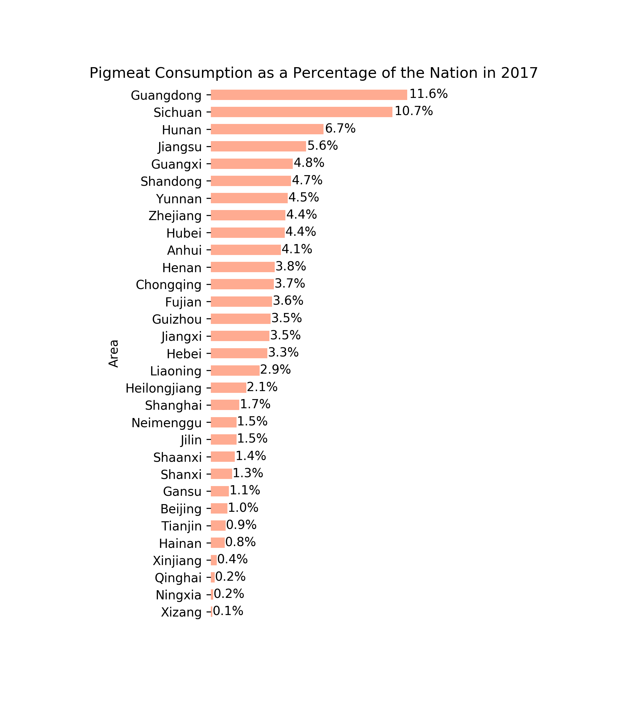

[BACK TO HOME](https://tane-rs.github.io/meat_atlas/)

# {{page.title}}
By {{page.author}} | 
Published at {{page.published_at | date: "%Y-%m-%d"}} | 
Updated at {{ page.updated_at | date: "%Y-%m-%d" }}

---

---

[BACK TO HOME](https://tane-rs.github.io/meat_atlas/)


  {{ tag }}


